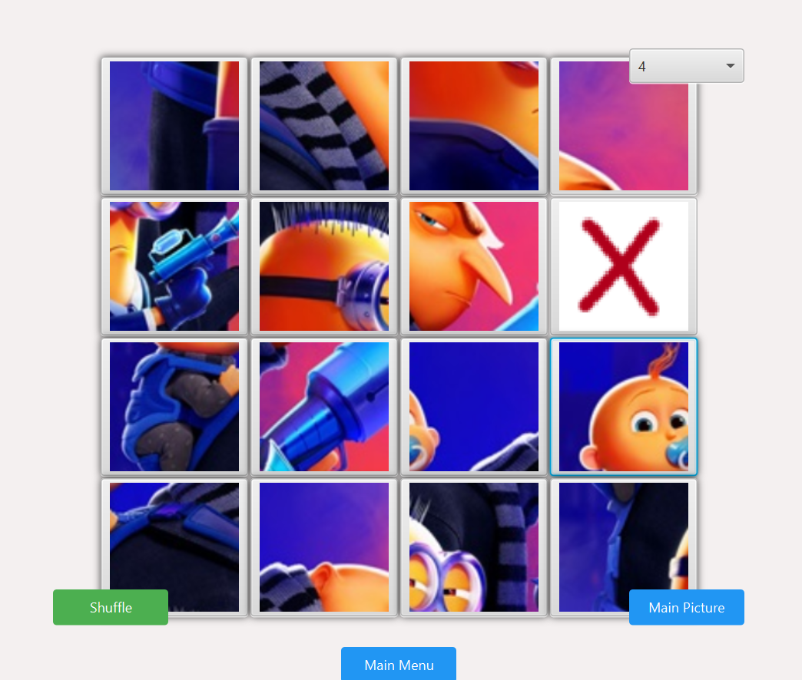

# PuzzleFX

PuzzleFX is a JavaFX application that allows users to play picture puzzle games. It provides a simple user interface for shuffling and solving puzzles.





## Features
PuzzleFX offers the following features to enhance your gaming experience:

- **Image Loading and Splitting:** Load images of your choice and automatically split them into puzzle pieces to create a challenging game board.
- **Puzzle Grid Customization:** Customize the size of the puzzle grid to adjust the difficulty level according to your preferences.
- **Game Controls:** Use intuitive controls to shuffle puzzle pieces, go back to the main menu, and view the original image for reference.
- **Timer Functionality:** Track your solving time with a built-in timer that starts when the game begins and stops when the puzzle is solved.
- **Congratulation Message:** Receive a congratulation message upon successfully solving the puzzle, along with the time taken to complete it.

## Getting Started
**Prerequisites:** Before running the game, make sure you have JavaFX properly set up in your system.

To start playing PuzzleFX, follow these simple steps:


1. Clone this repository to your local machine.
2. Open the project in your favorite Java IDE.
3. Run the `PuzzGame.java` file to start the application.
4. Choose an image to play the puzzle game.
5. Use the buttons to shuffle, go back to the main menu, and view the main picture.
6. Solve the puzzle by rearranging the pieces.
7. Once the puzzle is solved, a congratulation message will be displayed.

## Usage
Here's a brief overview of how to use PuzzleFX:

- When the application starts, you will see a menu page where you interact with the Start,option and exit buttons
- After clicking start game, the puzzle grid will be displayed.
- You can customize the size of the puzzle grid using the dropdown menu.
- Use the shuffle button to shuffle the puzzle pieces and start the game.
- you can also click on main Picture button to see the main and solved picture of that puzzle.
- Click on a puzzle piece adjacent to the empty space to move it into the empty space.
- Continue moving the pieces until the puzzle is solved.
- Once the puzzle is solved, a congratulation message will be displayed with the time taken to solve the puzzle.
- in the Congratulations message you can also see the time taken to solve the puzzle.

## How to Contribute
Welcome contributions to make PuzzleFX even better! If you have ideas or want to solve any existing issues, follow these steps to contribute:
1. Fork this repository to your GitHub account.
2. Create a new branch for your feature or bug fix:
```bash
git checkout -b feature/your-feature-name
```
3. Make your changes and commit them with a descriptive message:
```bash
git commit -m "Add feature or fix description"
```
4. Push your changes to your forked repository:
```bash
git push origin feature/your-feature-name
```
5. Submit a pull request from your branch to the main repository.

Once your pull request is reviewed and approved, your contribution will be merged into the main repository. We appreciate your help in improving PuzzleFX!

## Contributors

- [Asadullah Imran](https://github.com/Asadullah-Imran) .

## License

This project is licensed under the [MIT License](LICENSE).
